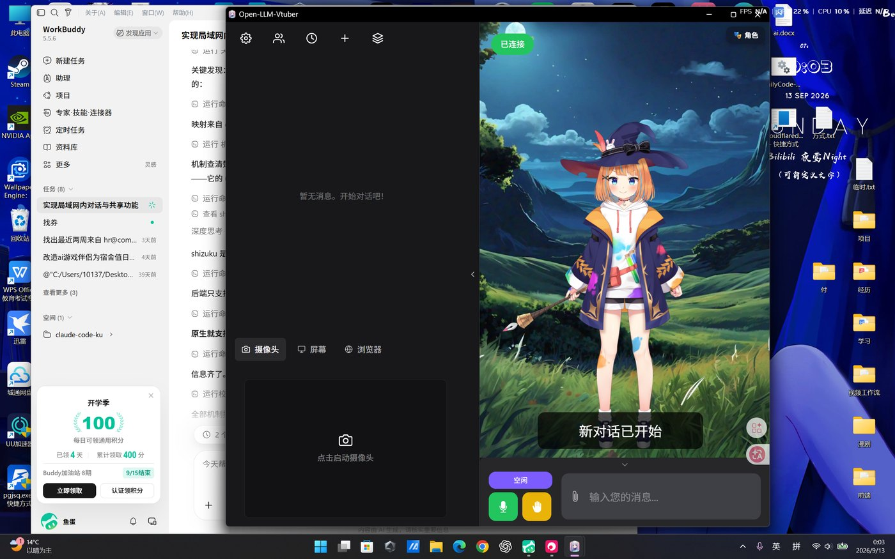
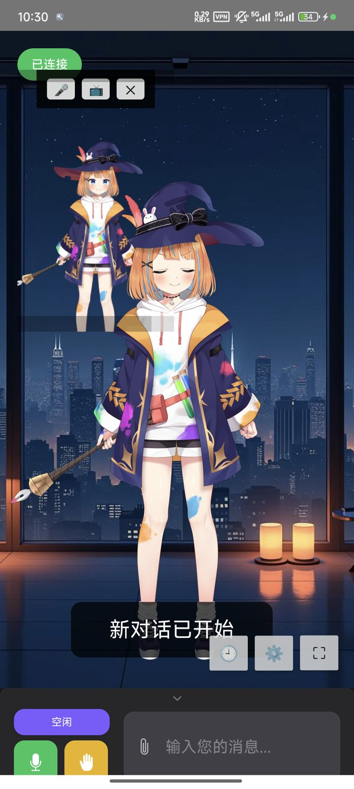
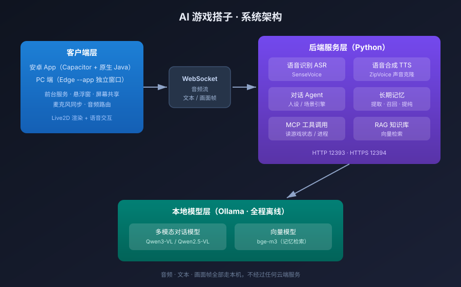

<div align="center">

# 🎮 AI 游戏搭子

**陪你打游戏的 AI 虚拟伴侣 —— 看得见你的屏幕、记得住你的事、认得你的声音**

[](https://www.python.org/)
[](https://developer.android.com/)
[](https://ollama.com/)
[](LICENSE)
[](#-系统架构)

[](screenshots/pc-main.jpg)

*PC 端主界面：Live2D 虚拟形象 + 语音对话 + 屏幕共享*

</div>

---

## 📖 这是什么

一个**完全跑在自己电脑上的 AI 虚拟伴侣**。她不是网页里那个只会打字的聊天框——她有 Live2D 立绘、能听见你说话、能用你自己的声音说话，还能**看见你的游戏画面**，在你打游戏的时候陪你聊天、吐槽、提醒你该干正事了。

所有推理都在本机完成（Ollama + 本地模型），**不需要联网、不需要 API Key、聊天记录不出你的电脑**。

同时提供 **PC 端和安卓 App 两套客户端**，手机上也能随身带着她。

## ✨ 核心特性

| | 特性 | 说明 |
|---|---|---|
| 🎭 | **Live2D 虚拟形象** | 内置 9 个官方示例模型（Haru / Hiyori / Mao / Rice / Shizuku / Natori / Ren / Wanko / Mark），支持表情与动作联动，可自由切换 |
| 🎙️ | **实时语音对话** | 本地 ASR（SenseVoice）+ 本地 TTS，说话打断、抢话、实时响应全支持 |
| 🗣️ | **声音克隆** | 用一段几秒的录音克隆任意声线，让她用你指定的声音说话 |
| 👀 | **屏幕感知** | 分享屏幕后，她能"看见"你在玩什么游戏、打到哪一步，主动接话而不是干等 |
| 🧠 | **三层长期记忆** | 系统提示注入 + 相关回忆自动检索 + 主动记忆工具；还会定期把零散记忆提纯归档 |
| 🛠️ | **MCP 工具调用** | 遵循 Model Context Protocol，可让她读取游戏状态、运行中的程序、当前时间等真实信息 |
| 📚 | **RAG 知识库** | 挂载本地知识库，回答跟你的资料/设定相关的问题 |
| 📱 | **安卓 App** | Capacitor + 原生 Java 混合架构，支持悬浮窗、屏幕共享、麦克风同步、后台常驻 |
| ⏰ | **主动说话** | 定时提醒、到点主动开口，不是只能被动应答 |
| 🔒 | **全程离线** | 音频、文本、画面帧都不出本机；不依赖任何云服务 |

## 👀 效果演示

| 手机端 App | 语音与动作 |
|:---:|:---:|
| [](screenshots/android-app.jpg) | [](screenshots/pc-main.jpg) |
| 竖屏 Live2D + 悬浮控制条 | 实时语音对话 + 口型动作同步 |

## 🏗️ 系统架构



**数据流**：客户端采集音频 / 画面帧 → WebSocket 送到后端 → ASR 转文字 → Agent 组装上下文（人设 + 记忆 + 工具结果）→ 本地 LLM 生成回复 → TTS 合成语音 → 回传客户端驱动 Live2D 口型与动作。

**分成两层**：

- **客户端层**：WebView 承载 Live2D 渲染与交互，原生层负责系统能力（前台服务保活、悬浮窗、屏幕采集、麦克风权限同步、音频路由）
- **服务层**：Python 后端，负责 ASR / Agent / 记忆 / 工具调用 / TTS，全部可插拔

## 🚀 快速开始

### 0. 环境要求

| 项目 | 要求 | 备注 |
|---|---|---|
| 操作系统 | Windows 10/11（主）、Linux / macOS（可运行后端） | 安卓构建建议在 Windows |
| Python | **3.10+** | 后端已用 uv 锁定依赖版本 |
| 内存 | 8GB+ | 模型越大要求越高 |
| 显卡 | 可选，有独显体验更好 | 无显卡可用 CPU 推理，速度慢 |
| 硬盘 | 20GB+ 可用空间 | 主要给模型文件 |
| 安卓构建 | JDK 17 + Android SDK（Gradle 8.2.1） | 只构建 App 时才需要 |

### 1. 获取代码

```bash
git clone https://github.com/kufu9369-cmd/ai-game-companion.git
cd ai-game-companion
```

> 仓库只包含**源码与配置**。模型权重、前端运行时库等大文件按下面步骤单独准备。

### 2. 安装后端依赖

```bash
cd backend

# 建议用虚拟环境隔离
python -m venv .venv
.venv\Scripts\activate          # Windows
# source .venv/bin/activate     # Linux / macOS

pip install -r requirements.txt
```

> 💡 前端运行时里有几个 onnxruntime 的 wasm 文件（约 40MB）没有入库。
> 从 [onnxruntime-web 官方包](https://www.npmjs.com/package/onnxruntime-web) 里取出 `ort-wasm*.wasm`，
> 或从你本地的 `node_modules` 里复制，放进 `backend/frontend/libs/` 即可。

### 3. 准备本地模型

**a) 对话模型（必需）**

```bash
# 安装 Ollama 后拉取一个多模态模型（能看屏幕画面）
ollama pull qwen2.5vl:7b

# 可选：自定义一份带参数的 Modelfile，降低上下文占用、关闭思考链
ollama create qwen25vl-gc:7b -f Modelfile
```

示例 `Modelfile`：

```dockerfile
FROM qwen2.5vl:7b

PARAMETER num_ctx 4096
PARAMETER temperature 0.7
PARAMETER top_k 20
PARAMETER num_predict 512
```

**b) 向量模型（记忆检索用，可选但推荐）**

```bash
ollama pull bge-m3
```

**c) 语音模型**

ASR（SenseVoice）与 TTS 模型按 `backend/config_templates/` 里的说明下载，放到 `backend/models/` 对应子目录。
`backend/models/` 与 `backend/live2d-models/` 都在 `.gitignore` 里，不会进版本库。

### 4. 启动

```bash
# 确保 Ollama 在跑
ollama serve

# 启动后端（默认 HTTP 12393 / HTTPS 12394）
python run_server.py
```

浏览器打开 `http://127.0.0.1:12393` 就能看到 Live2D 界面。

Windows 用户也可以直接用 `scripts/` 下的批处理：

| 脚本 | 作用 |
|---|---|
| `游戏搭子PC端.bat` | 一键启动后端 + 用 Edge 以独立窗口打开（像原生应用） |
| `启动后端.bat` | 只启动后端 |
| `停止游戏搭子.bat` | 关闭后端进程 |

### 5. 构建安卓 App

```bash
cd android

# 1) 安装前端依赖（Capacitor）
npm install

# 2) 把前端页面同步到安卓工程
npx cap sync android

# 3) 编译 Debug APK
cd android
./gradlew assembleDebug
```

产物：`android/app/build/outputs/apk/debug/app-debug.apk`

> **首次构建提示**：Gradle 会自动下载依赖（仓库已配置阿里云镜像加速）。
> 如果卡在下载，检查 `android/gradle/wrapper/gradle-wrapper.properties` 里的版本是否可访问。

**装到手机后要做的三件事**：

1. 在 App 设置里填写后端地址（局域网 IP，例如 `192.168.1.10:12393`）
2. 授予**悬浮窗**、**屏幕录制**、**麦克风**权限
3. 如果后端开了 HTTPS，需要把 CA 证书装进系统的信任锚（否则 WebSocket 握手会失败）

## ⚙️ 配置说明

主配置在 `backend/conf.yaml`。改完重启后端生效。

```yaml
# 对话模型（三处要保持一致，否则会反复装卸模型）
llm_provider: "ollama_llm"
ollama_llm:
  model: "qwen25vl-gc:7b"

# 语音识别
asr_model: "sensevoice"

# 语音合成（改成 sherpa_onnx_tts 可切换回内置音色）
tts_model: "zipvoice_tts"

# 是否允许她调用本地工具（读游戏状态、进程等）
basic_memory_agent:
  use_mcpp: true
mcp_enabled_servers: ["companion-tools"]
```

**可调的关键项**：

| 配置 | 位置 | 作用 |
|---|---|---|
| 角色人设 | `backend/characters/*.yaml` | 换角色、改性格、改称呼 |
| Live2D 形象 | `backend/model_dict.json` | 表情与动作映射（`emotionMap`） |
| 工具列表 | `backend/mcp_servers.json` | 想让她多会一件事，就往这里加一条 |
| 主动说话 | `conf.yaml` 的 `proactive_speak_enabled` | 开启后她会定时主动开口 |

## 🎙️ 声音克隆怎么用

1. 准备一段 **5~15 秒的干净人声**（无背景音乐、无混响），存成 `wav`
2. 放进 `backend/tts_voices/<声音名>/`，同目录放一个 `voice.json`：

```json
{
  "name": "我的声音",
  "text": "这段参考音频里说的原话"
}
```

> `text` 字段必填，且要跟音频内容一致，否则克隆质量会明显下降。

3. 重启后端，在界面右侧工具栏的 🎙 面板里切换声线

## 🧠 长期记忆与工具调用

**记忆分三层**，越靠下的越省 token、越按需：

1. **系统提示注入** —— 最相关的十几条记忆直接写进 System Prompt
2. **相关回忆检索** —— 对话时按关键词自动召回历史记忆
3. **主动检索工具** —— 她觉得需要时，自己调 `search_memory` 去翻

**记忆提纯**：当零散记忆积累到一定数量，会自动压缩合并，旧的归档保留（仍可被检索到），避免记忆库无限膨胀。

**内置工具**（`mcp_servers/companion_tools/`，只读、零干扰）：

| 工具 | 作用 |
|---|---|
| `get_game_context` | 读取当前游戏状态 |
| `get_running_apps` | 看你在跑什么程序 |
| `get_current_time` | 当前时间 |
| `search_memory` | 主动翻长期记忆 |
| `remember_fact` | 主动记下一件事 |

接更多能力 = 往 `mcp_servers.json` 里加条目，不用改核心代码。

## 📁 目录结构

```
ai-game-companion/
├── backend/                    # Python 后端
│   ├── src/open_llm_vtuber/    # 后端框架（基于 Open-LLM-VTuber）
│   ├── game_companion/         # ★ 本项目自研：Agent / 记忆 / RAG / 场景引擎
│   │   ├── agent/              #   对话 Agent 主逻辑
│   │   ├── memory/             #   三层记忆：提取 / 召回 / 提纯 / 定时提醒
│   │   └── rag/                #   知识库检索
│   ├── mcp_servers/            # ★ MCP 工具服务器（可扩展）
│   ├── frontend/               # ★ 前端界面（Live2D 渲染 + 交互）
│   ├── characters/             # 角色卡（人设）
│   ├── prompts/                # 提示词模板
│   ├── config_templates/       # 配置模板与说明
│   └── conf.yaml               # 主配置
├── android/                    # 安卓 App
│   ├── app/src/main/java/ai/game/companion/mobile/
│   │   ├── MainActivity.java            # 主界面与 WebView 桥接
│   │   ├── FloatWindowService.java      # 桌面悬浮窗（挂机模式）
│   │   ├── ScreenShareService.java      # 屏幕采集（MediaProjection）
│   │   ├── ScreenShareManager.java      # 采集会话管理
│   │   ├── ScreenShareGrantActivity.java# 录屏授权中转页
│   │   ├── MicSync.java                 # 麦克风状态同步
│   │   ├── SoundSync.java               # 音频播放同步
│   │   ├── SettingsActivity.java        # 设置页
│   │   ├── HistoryActivity.java         # 聊天记录
│   │   └── ChatHistory.java             # 记录存取
│   ├── app/src/main/res/       # 图标与资源
│   ├── www/                    # 前端页面（Capacitor 同步源）
│   └── capacitor.config.ts     # 允许导航的网段配置
├── scripts/                    # 一键启动脚本
├── screenshots/                # 文档用图
└── docs/                       # 补充文档
```

## ❓ 常见问题

<details>
<summary><b>启动后端报端口占用（12393 / 12394）</b></summary>

上一个实例没退干净。先结束占用进程再启动：

```bash
# Windows
netstat -ano | findstr :12393
taskkill /F /PID <上面查到的PID>
```
</details>

<details>
<summary><b>界面能打开，但她不回话</b></summary>

按顺序排查：

1. Ollama 是否在跑：`curl http://localhost:11434`
2. 模型名对不上：`conf.yaml` 里三处模型名要保持一致（`llm_provider`、`extract_llm.model`、`ollama_llm.model`）
3. 显存不够导致模型反复装卸：换个更小的模型，或调低 `num_ctx`
</details>

<details>
<summary><b>安卓 App 打开是白屏 / 一直停在配置页</b></summary>

WebView 拒绝导航了。检查 `android/capacitor.config.ts` 的 `allowNavigation` 里**是否包含你实际用的后端地址网段**——尤其是用 `adb reverse` 时地址是 `127.0.0.1`，漏了这一条就会永远停在 Capacitor 的 `https://localhost` 配置页。
</details>

<details>
<summary><b>手机端 HTTPS / WebSocket 连不上</b></summary>

WebSocket 的 TLS 校验失败**不会**走安卓的 `onReceivedSslError` 回调，因此不能靠忽略证书错误解决。正确做法是把后端自签的 CA 证书装进系统信任锚，客户端才会认。

另外后端证书是跟 IP 绑定的，**换了网络环境要重新签发**。
</details>

<details>
<summary><b>手机插耳机后声音从听筒出来 / 声音很小</b></summary>

安卓在 `MODE_IN_COMMUNICATION` 下会自动切听筒。原生层做了音频路由守护，如果仍异常，检查是否被其他应用的音频焦点抢占。
</details>

<details>
<summary><b>说话总被"抢话"打断</b></summary>

VAD 灵敏度问题。调高静音判定阈值、增加最小语音帧数，或在配置里延长"抢话需要持续的时间"。
</details>

## 🛠️ 技术栈

| 层 | 技术 |
|---|---|
| 对话模型 | Ollama + Qwen2.5-VL / Qwen3-VL（本地多模态） |
| 向量模型 | bge-m3 |
| 语音识别 | SenseVoice |
| 语音合成 | ZipVoice（声音克隆）/ sherpa-onnx（内置音色） |
| 后端 | Python · WebSocket · FastAPI |
| Agent 能力 | MCP（Model Context Protocol）· 三层记忆 · RAG |
| 前端 | Live2D Cubism · 原生 HTML/JS |
| 安卓 | Capacitor · Java · MediaProjection · 前台服务 |
| PC 端 | Edge `--app` 独立窗口 |

## 🤝 致谢

- 后端框架基于 [Open-LLM-VTuber](https://github.com/Open-LLM-VTuber/Open-LLM-VTuber)（MIT），本项目在其上做了大量定制：游戏场景引擎、三层记忆、MCP 工具、屏幕感知、安卓客户端等
- Live2D 模型来自 Live2D 官方示例（使用请遵守 [Live2D 许可](https://www.live2d.com/eula/live2d-proprietary-software-license-agreement_cn.html)）
- 感谢 [Ollama](https://ollama.com/)、[SenseVoice](https://github.com/FunAudioLLM/SenseVoice)、[ZipVoice](https://github.com/k2-fsa/ZipVoice) 等开源项目

## 📄 许可

本项目代码采用 **MIT License**，详见 [LICENSE](LICENSE)。

第三方组件与模型分别遵循各自许可（`backend/` 下保留了上游的 LICENSE 与 LICENSE-Live2D.md）。

---

<div align="center">

**如果这个项目对你有帮助，欢迎点个 ⭐ Star**

</div>
